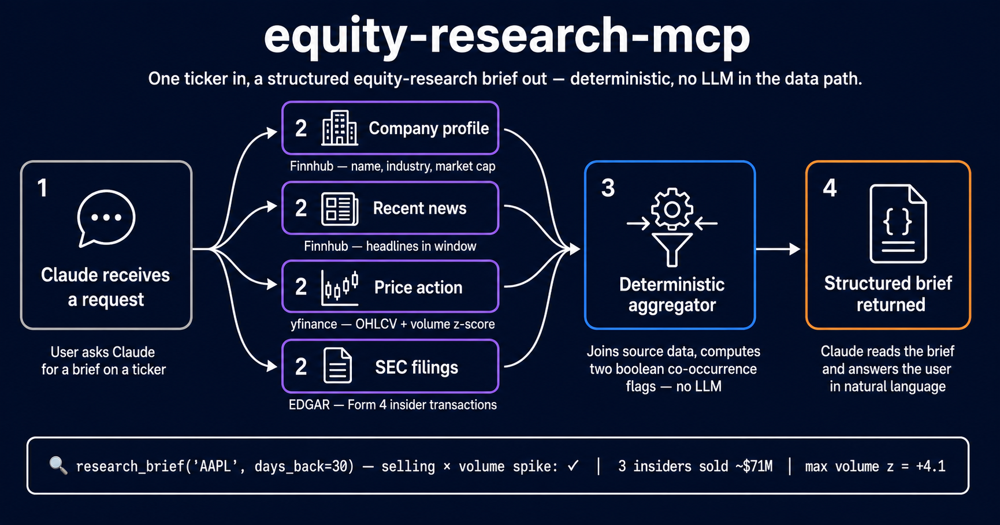

# equity-research-mcp

<p align="center">
  
</p>

A locally-installable [MCP server](https://modelcontextprotocol.io) that
aggregates US-equity research from three free data sources — SEC EDGAR,
Finnhub, yfinance — into a single set of tools for Claude Desktop and
Claude Code. Filings, daily price/volume with z-scored anomaly
detection, news, company profile, and a `research_brief` aggregator
that fans out concurrently and surfaces deterministic
insider-activity-meets-volume signals.

**Status: v0.1.0** — five working tools, three live data sources, US
equities only, research-side only. The full feature surface is
implemented; the LLM critic and retry layers are deferred to v0.2/v0.3
(see "Design decisions" below).

## What this is NOT

- Not a trading system. No order routing, no brokerage integration.
- Not a screener. No "give me stocks where X." It works ticker-by-ticker.
- Not a signal generator. The correlation flags are co-occurrence
  booleans over a window, not buy/sell calls.
- Not a backtest engine. There's no historical P&L or strategy
  evaluation.
- Not a sentiment analyzer. No social source ships in v0.1; three
  source-tier checks failed in sequence (see "Design decisions").

## Tools

Five MCP tools (`health` is a server diagnostic and isn't counted):

| Tool | Source | What it does |
|---|---|---|
| `get_company_profile(ticker)` | Finnhub | Name, exchange, industry, market cap, shares outstanding. |
| `get_price_action(ticker, start, end)` | yfinance | Daily OHLCV bars over a date range plus a 30-trading-day rolling volume z-score per bar. |
| `get_news(ticker, start, end)` | Finnhub | Company news headlines over a date range. |
| `get_recent_filings(ticker, filing_types, days_back)` | SEC EDGAR | Form 4 / 8-K / 13G / 13D filings in the last `days_back` days. **Form 4 includes parsed insider transactions** — insider name, role, transaction code (P/S/A/D/M/G), shares, price, direct/indirect ownership. |
| `research_brief(ticker, days_back)` | **Aggregator** | Fans out over the four sources above concurrently and returns a structured brief with deterministic cross-source flags. |

## The headline tool: `research_brief`

`research_brief` is the discovery angle of the project. It runs the
four single-source tools in parallel under one shared request budget
and computes two boolean flags from the joined data:

| Flag | Trigger |
|---|---|
| `insider_buying_with_volume_spike` | ≥1 Form 4 with transaction code `P` (open-market purchase) **and** `acquired_or_disposed = A`, **and** ≥1 trading day in the window with `volume_zscore_30d ≥ 2.0`. |
| `insider_selling_with_volume_spike` | ≥1 Form 4 with code `S` and `acquired_or_disposed = D`, **and** ≥1 trading day with `volume_zscore_30d ≥ 2.0`. |

The `z ≥ 2.0` threshold is the conventional volume-anomaly bar — under
a normal distribution, ~5% of trading days clear it. Open-market
purchases are the rarest insider transaction type (managers default to
selling vested grants), so a P/A buy paired with abnormal volume is
the headline discovery signal. Selling-with-spike is the cautionary
mirror.

Each flag is **co-occurrence within the `days_back` window**, NOT
same-day or near-in-time correlation. An insider buy on day 2 and a
volume spike on day 28 trip the buying flag exactly as both events on
day 5. The boolean labels what happened in the window, not how tightly
the events lined up. Temporal-proximity scoring is a future refinement.

### Real output

Sample `research_brief("AAPL", days_back=30)` from a recent run
(insider names anonymized; share counts, prices, and z-scores are
genuine):

```json
{
  "ticker": "AAPL",
  "days_back": 30,
  "start": "2026-04-23",
  "end": "2026-05-23",
  "generated_at": "2026-05-23T17:01:40.586099Z",
  "flags": {
    "insider_buying_with_volume_spike": false,
    "insider_selling_with_volume_spike": true
  },
  "profile":      { "ok": true,  "error": null, "data": { /* Apple Inc, NASDAQ, ... */ } },
  "price_action": { "ok": true,  "error": null, "data": {
      "bars": [ /* 22 daily bars; max volume_zscore_30d = +4.108 */ ]
  }},
  "news":         { "ok": true,  "error": null, "data": { /* 247 headlines */ } },
  "filings":      { "ok": true,  "error": null, "data": {
      "filings": [
        {
          "ticker":            "AAPL",
          "form_type":         "4",
          "filed_at":          "2026-05-12T00:00:00",
          "accession_number":  "0001140361-26-020871",
          "url":               "https://www.sec.gov/Archives/edgar/data/320193/000114036126020871/xslF345X06/form4.xml",
          "summary":           null,
          "source":            "edgar",
          "transactions": [{
            "insider_name":         "OFFICER A",
            "insider_relationship": "Officer: Principal Accounting Officer",
            "transaction_code":     "S",
            "acquired_or_disposed": "D",
            "shares":               1274,
            "price":                "290",
            "is_direct":            true,
            "transaction_date":     "2026-05-08"
          }]
        },
        {
          "ticker":            "AAPL",
          "form_type":         "4",
          "filed_at":          "2026-05-08T00:00:00",
          "accession_number":  "0001140361-26-020298",
          "url":               "https://www.sec.gov/Archives/edgar/data/320193/000114036126020298/xslF345X06/form4.xml",
          "summary":           null,
          "source":            "edgar",
          "transactions": [
            { "insider_name": "DIRECTOR A", "insider_relationship": "Director",
              "transaction_code": "S", "acquired_or_disposed": "D",
              "shares": 149527, "price": "284.57", "is_direct": true,
              "transaction_date": "2026-05-06" },
            { "insider_name": "DIRECTOR A", "insider_relationship": "Director",
              "transaction_code": "S", "acquired_or_disposed": "D",
              "shares": 100473, "price": "285.04", "is_direct": true,
              "transaction_date": "2026-05-06" },
            { "insider_name": "DIRECTOR A", "insider_relationship": "Director",
              "transaction_code": "G", "acquired_or_disposed": "D",
              "shares": 5000, "price": "0", "is_direct": true,
              "transaction_date": "2026-05-06" }
          ]
        },
        {
          "ticker":            "AAPL",
          "form_type":         "4",
          "filed_at":          "2026-04-27T00:00:00",
          "accession_number":  "0001140361-26-017175",
          "url":               "https://www.sec.gov/Archives/edgar/data/320193/000114036126017175/xslF345X06/form4.xml",
          "summary":           null,
          "source":            "edgar",
          "transactions": [{
            "insider_name":         "OFFICER B",
            "insider_relationship": "Officer: Senior Vice President, CFO",
            "transaction_code":     "S",
            "acquired_or_disposed": "D",
            "shares":               1534,
            "price":                "275",
            "is_direct":            true,
            "transaction_date":     "2026-04-23"
          }]
        },
        {
          "ticker":            "AAPL",
          "form_type":         "8-K",
          "filed_at":          "2026-04-30T00:00:00",
          "accession_number":  "0000320193-26-000011",
          "url":               "https://www.sec.gov/Archives/edgar/data/320193/000032019326000011/aapl-20260430.htm",
          "summary":           null,
          "source":            "edgar",
          "transactions":      null
        }
      ]
  }}
}
```

What the brief is saying in plain English: in the last 30 days (the
`days_back` window filters on SEC **filing date** — note `filed_at`
and `transaction_date` differ in the JSON above for filings reporting
trades a few days earlier), three insiders (a director and two
officers) all made open-market sales totalling ~253K shares at prices
between $275 and $290, and on at least one trading day in that same
window volume was 4.1 standard deviations above the 30-day average.
The selling-with-spike flag fires. The buying flag does not — there
were zero open-market insider buys.

### Graceful degradation

If a source fails (rate limit, 4xx, parse failure, missing credential),
that section returns `ok=false, error="<ExceptionType>: <message>"` and
the rest of the brief stands. Same call with `FINNHUB_API_KEY`
deliberately unset:

```json
{
  "profile":      { "ok": false, "data": null, "error": "MissingCredentials: ..." },
  "news":         { "ok": false, "data": null, "error": "MissingCredentials: ..." },
  "price_action": { "ok": true, "data": { /* 22 bars */ } },
  "filings":      { "ok": true, "data": { /* 4 filings */ } },
  "flags":        { "insider_selling_with_volume_spike": true, "insider_buying_with_volume_spike": false }
}
```

The selling flag still fires because `price_action` and `filings` both
have data. `BudgetExceeded` is treated differently — it's the brief's
safety cap firing, not a source error, and propagates as an exception
rather than degrading silently into a fake section outage.

## Quickstart

Five to ten minutes on a clean machine for the core. Python 3.12
required.

```bash
git clone <repo-url> equity-research-mcp
cd equity-research-mcp
python3.12 -m venv .venv
.venv/bin/python -m pip install -e ".[dev]"
.venv/bin/python -m pytest    # 99/99 should pass offline
```

### Environment variables

| Variable | Required for | How to get it |
|---|---|---|
| `FINNHUB_API_KEY` | `get_company_profile`, `get_news` (and the corresponding `research_brief` sections) | [Free tier at finnhub.io](https://finnhub.io). Sign-up + email confirmation. |
| `SEC_USER_AGENT` | `get_recent_filings` | No registration. Set to `"Your Name your@email"` — SEC's fair-access policy requires an identifying UA on every request. |

`get_price_action` needs no key (uses yfinance, the unofficial Yahoo
Finance client). Set the vars in your shell:

```bash
export FINNHUB_API_KEY="..."
export SEC_USER_AGENT="Your Name your@email"
```

`.env` files are gitignored by design (see `.env.example` for the
documentation-only template); the server reads from your real
environment, not from a dotfile in the repo.

### Mounting in Claude Desktop

Add to `~/Library/Application Support/Claude/claude_desktop_config.json`
(macOS) or `%APPDATA%\Claude\claude_desktop_config.json` (Windows):

```json
{
  "mcpServers": {
    "equity-research": {
      "command": "/absolute/path/to/equity-research-mcp/.venv/bin/equity-research-mcp",
      "env": {
        "FINNHUB_API_KEY": "your_key_here",
        "SEC_USER_AGENT": "Your Name your@email"
      }
    }
  }
}
```

Restart Claude Desktop. The five tools should appear in the tool list.

Note: this writes your `FINNHUB_API_KEY` into the Claude Desktop config
file in cleartext. The file lives outside the repo (in your OS
application-support directory) and is read only by Claude Desktop, but
treat it accordingly — same care you'd give a `.env` file. The rest of
the project keeps keys in your shell environment by design.

### Mounting in Claude Code

Use the JSON-config form (`claude mcp add-json`). The shorthand
`claude mcp add -e KEY=value ... <name> -- <command>` form looks
simpler in the docs, but its `-e/--env` flag is declared variadic in
the Claude Code CLI and can greedily absorb the server-name positional
when you have more than one env var. The JSON form passes all
configuration through a single argument and avoids the ambiguity.

Run this **from the repo root** (the `$(pwd)` expansion picks up the
absolute path so you don't have to substitute it manually):

```bash
claude mcp add-json equity-research "$(cat <<JSON
{
  "type": "stdio",
  "command": "$(pwd)/.venv/bin/equity-research-mcp",
  "env": {
    "FINNHUB_API_KEY": "$FINNHUB_API_KEY",
    "SEC_USER_AGENT": "$SEC_USER_AGENT"
  }
}
JSON
)"
```

`$(pwd)`, `$FINNHUB_API_KEY`, and `$SEC_USER_AGENT` are all expanded
by the shell inside the heredoc before the JSON reaches `claude`.
Verify with `claude mcp list` (and `claude mcp get equity-research`
if you want detail — be aware the latter prints your env values in
cleartext to the terminal). Remove with
`claude mcp remove equity-research`.

### First command to try

Once mounted, ask Claude:

> Run `research_brief` on AAPL for the last 30 days and tell me what
> the flags mean.

The brief will fan out across the four single-source tools
concurrently. A warm cache lets the second call on the same ticker
skip the network entirely (filesystem reads only); the actual latency
is unmeasured.

## Architecture

The interesting engineering is in five places, all small and
deliberately so:

### `SourceAdapter` — the extension protocol

`src/equity_research_mcp/adapters/protocol.py` declares a `typing.Protocol`
that every data source implements. Methods a source doesn't support
raise `SourceCapabilityError` rather than `NotImplementedError` or
silent `None` returns — the failure mode is typed and the aggregator is
source-unaware. v0.1 ships three implementations: `FinnhubAdapter`,
`YFinanceAdapter`, `EdgarAdapter`. The Protocol also declares a
`get_social_mentions` method as a documented extension seam — no v0.1
adapter implements it, but a future Reddit / paid StockTwits / Bluesky
adapter can land without restructuring the contract.

### Per-call budget via `ContextVar`

`src/equity_research_mcp/budget.py`. Every tool call enters a fresh
`Budget` context with named buckets (`requests` at v0.1; `tokens`
reserved for v0.3). Adapters charge the bucket on each outbound HTTP
call — exceeding the limit raises `BudgetExceeded` as a hard fail.
`research_brief` sets a single shared 80-request budget across its
four concurrent gather tasks; a runaway fan-out fails loud rather than
degrading silently into "looks like several APIs are down."

### Filesystem cache, content-hash key, per-source TTL

`src/equity_research_mcp/cache.py`. JSON files under
`~/.cache/equity-research-mcp/`. Cache key is SHA-256 of `(source,
endpoint, params)`. TTLs are per-source: price 1d, filings 7d
(individual SEC filings are immutable; the submissions index 1d), news
4h, company profile 7d, SEC ticker map 7d. Cache hits skip both the
HTTP call and the budget charge.

The cache treats itself as a perf layer, not load-bearing: a failed
write (disk full, permissions) emits a `RuntimeWarning` and continues
in pass-through mode rather than crashing the request. Same for the
`mkdir` at construction.

### Three live data sources

- **SEC EDGAR** — genuinely free, the gold-standard primary source.
  `SEC_USER_AGENT` is the only requirement. Form 4 ownership-document
  XML is parsed via stdlib `xml.etree.ElementTree`. One bad filing
  doesn't crash the call: per-filing parse failures yield a `Filing`
  with `transactions=None` and a `RuntimeWarning`.
- **Finnhub** — free tier covers company profile and company news.
  Their `/stock/candle` price endpoint moved to paid tier in 2023, so
  price bars come from yfinance instead.
- **yfinance** — unofficial Yahoo Finance scraper. No key, broad
  coverage, but best-effort: Yahoo occasionally changes endpoints and
  yfinance breaks until upstream patches. Documented as best-effort in
  every relevant docstring; it's the right tradeoff for v0.1 (no
  paywall) but it's a real fragility.

### Single Anthropic gateway (dormant in v0.1)

`equity_research_mcp.llm.ClaudeClient` (planned for v0.3) is the only
place Anthropic API calls are allowed to originate. v0.1 has zero
Anthropic calls; the gateway lands with the LLM critic.

### Async throughout

Adapters use `httpx.AsyncClient`. yfinance is sync, wrapped in
`asyncio.to_thread`. The aggregator uses `asyncio.gather` for fan-out.
Tests use `pytest-asyncio` in `auto` mode — no `@pytest.mark.asyncio`
markers needed.

## Design decisions

**Deterministic aggregator, no model in the data path.** v0.1 has zero
LLM calls anywhere in the brief — both correlation flags are pure
boolean expressions over the joined source data, no LLM scores, no
probabilistic weighting. The Anthropic gateway (`equity_research_mcp.
llm.ClaudeClient`) exists as a v0.3 seam but is dormant. The flags are
discovery triggers; the consumer (human or LLM critic) reads the brief
data to size or qualify the signal. This means the flags are
auditable, testable, and reproducible run-to-run.

**No social source in v0.1.** Three source-tier checks failed in
sequence: Finnhub's free-tier paywall on price candles, Reddit account
ban (no compliant API access remaining for the developer), and
StockTwits' Cloudflare browser-fingerprinting gate on its public
symbol stream. Pattern: free, accessible, scriptable social-equity
data is consistently gated. The two headline signals (volume z-score
and insider Form 4 direction) are live without it. v0.1 ships with
five tools as a deliberate scope decision — see CLAUDE.md "Social
source dropped from v0.1" for the full rationale.

**Source-tier verification meta-rule.** Every new adapter phase
verifies free-tier access against the actual endpoints BEFORE writing
the adapter, not after. Two failures (Finnhub price, Reddit access)
taught the rule the expensive way; subsequent attempts (EDGAR pass,
StockTwits fail) caught their realities at the probe step instead of
mid-build.

**Deliberately deferred.** Each of the following is on the roadmap and
deliberately NOT in v0.1:

- **LLM critic** (v0.3): a Claude-Sonnet pass that reads the brief and
  produces a short qualitative summary. The gateway and tokens bucket
  land together.
- **Tenacity retry on 429** (v0.2): currently the adapters raise
  `RateLimited` immediately on a 429 and let the caller decide.
  Tenacity-backed exponential-backoff retry is reliability work for
  v0.2.
- **A social adapter** (v0.2+ if a compliant access path opens): the
  Protocol seam is in place.

## Development

Project conventions live in [CLAUDE.md](CLAUDE.md). Adapter rules in
[src/equity_research_mcp/adapters/CLAUDE.md](src/equity_research_mcp/adapters/CLAUDE.md).

### Tests

Offline only, fixture-based. 99 tests across:

- Schema validation (frozen models, type round-trips).
- Adapter normalization (each adapter has 15–22 fixture-driven tests).
- Aggregator logic (13 tests including BudgetExceeded propagation and
  the co-occurrence flag rules).
- Budget mechanics, cache TTL/key behavior, error taxonomy.

No live network calls in the test suite. Finnhub and EDGAR tests use
[respx](https://lundberg.github.io/respx/) for transport-level httpx
mocking. yfinance tests mock at the library's `_fetch_history` helper
boundary (the equivalent transport seam for a library client).

```bash
.venv/bin/python -m pytest                 # full suite
.venv/bin/python -m pytest tests/adapters  # just adapter tests
.venv/bin/python -m pytest --cov           # with coverage
```

### Excluded from coverage by design

The following modules contain no testable business logic and are
excluded from coverage:

- `src/equity_research_mcp/server.py` — FastMCP server startup +
  thin `@mcp.tool()` decorators that delegate to `tools.py`. The
  decorator bodies are one line.
- `src/equity_research_mcp/__init__.py` — package metadata only.
- `src/equity_research_mcp/adapters/protocol.py` — `typing.Protocol`
  declaration; method signatures are abstract by construction (no
  executable body to cover). Structurally tested by each adapter
  implementation conforming to it.

`src/equity_research_mcp/tools.py` is included in coverage but reports
lower than the rest of the codebase. It contains the adapter-dispatch
helpers and the per-tool budget-context wrappers. The dispatch glue is
exercised through the live smoke runs (see the headline-tool section
above), not through unit tests; the substantive logic — adapters,
aggregator, schemas, budget, cache, errors — is fully unit-tested.

## Versioning

Conventional Commits. One feature branch per phase
(`phase/NN-short-name`). Annotated tags only at release boundaries
(`v0.1.0` is the first).
